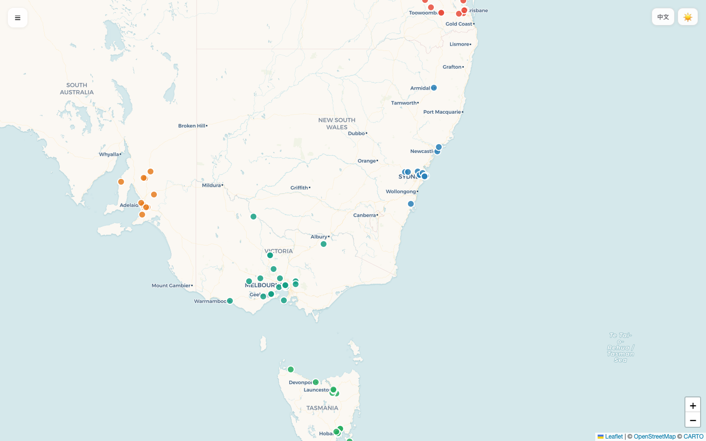
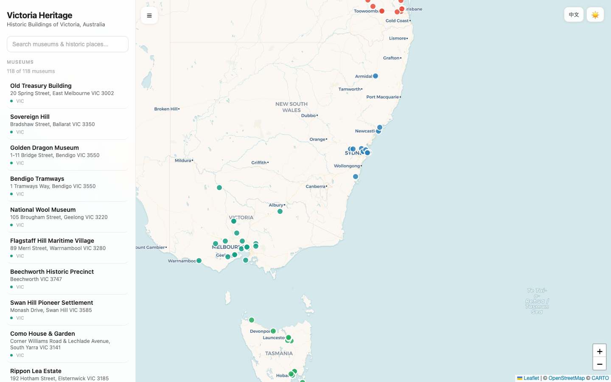
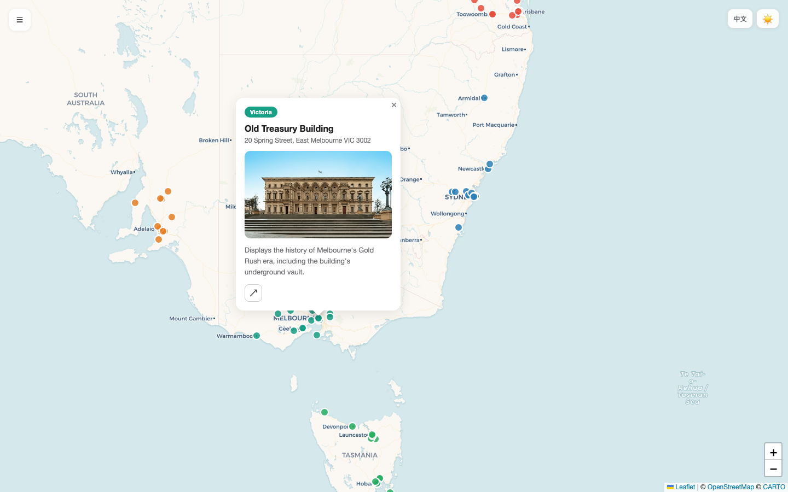
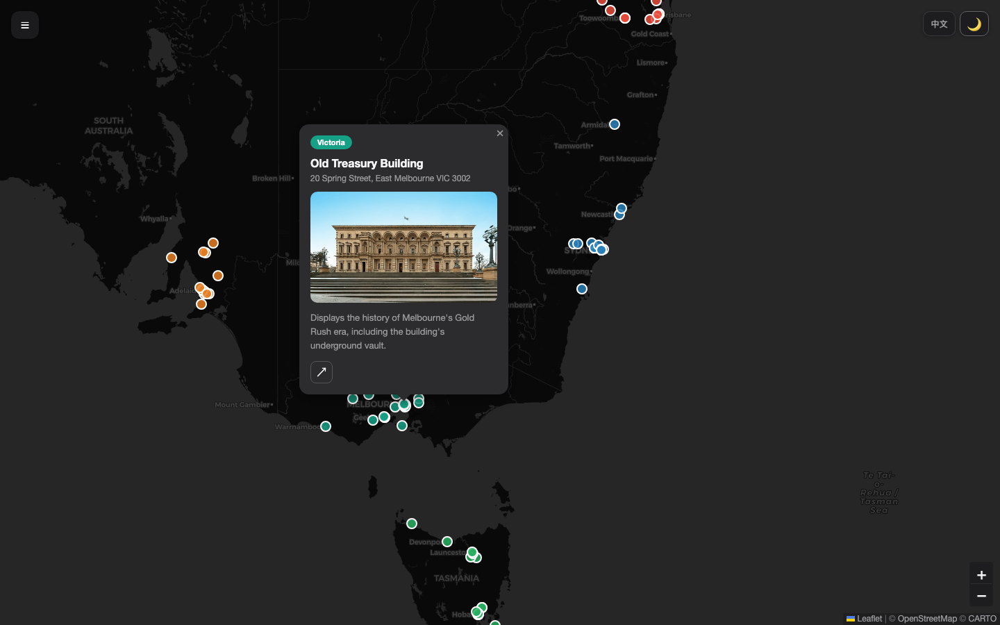
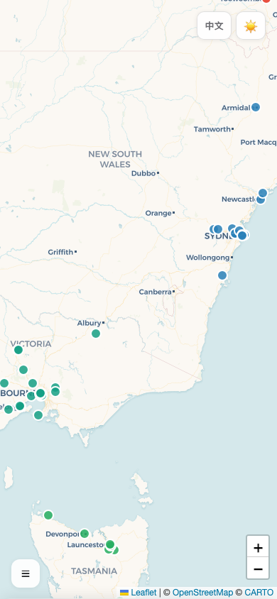
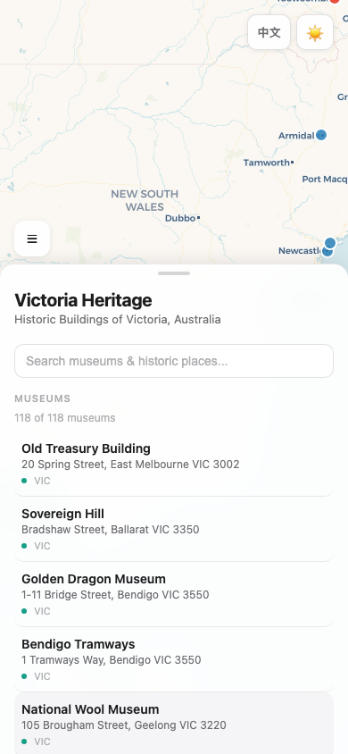
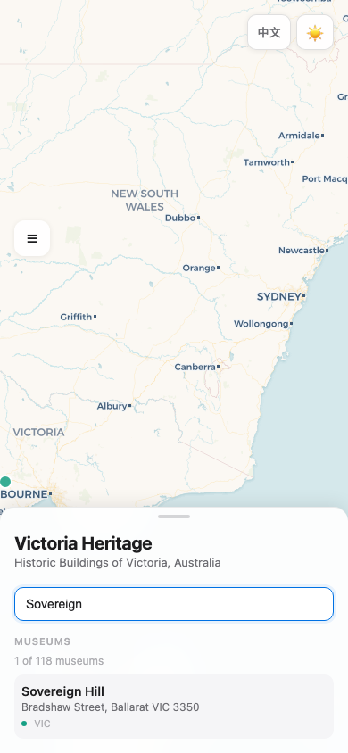
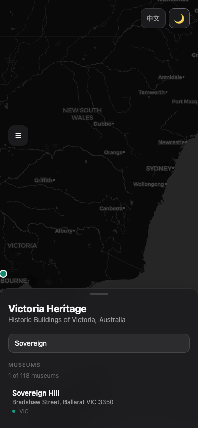

# Australia Heritage Map

An interactive map for exploring Australia's historic buildings, museums, and heritage sites across all states and territories.

## How to Use

**Browse the map** — Colored markers represent heritage sites across VIC, NSW, QLD, SA, WA, TAS, and NT. Pan and zoom to explore.

**Open a marker** — Click any marker to see the site's name, address, description, preview image, and a link to visit its official website.

**Search** — Open the sidebar with the menu button (top-left) and type a name or address to filter sites instantly.

**Switch language** — Tap the "EN / 中文" button (top-right) to toggle between English and Chinese descriptions.

**Toggle dark mode** — Tap the sun/moon icon (top-right) to switch between light and dark themes. It follows your system preference by default.

**Mobile** — On smaller screens the sidebar becomes a bottom sheet that slides up for easy one-handed browsing.

## Screenshots

| Desktop | |
|---|---|
| Map overview |  |
| Sidebar & search |  |
| Museum popup |  |
| Dark mode |  |

| Mobile | |
|---|---|
| Map overview |  |
| Bottom sheet |  |
| Search |  |
| Dark mode |  |
